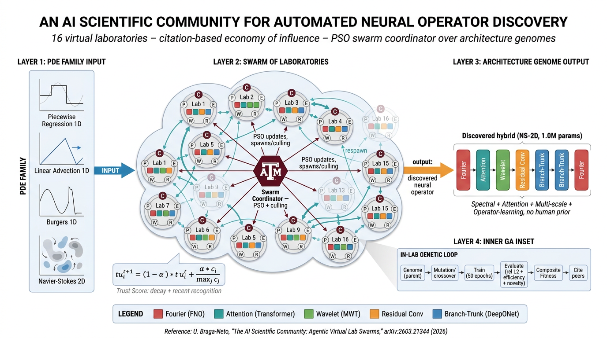
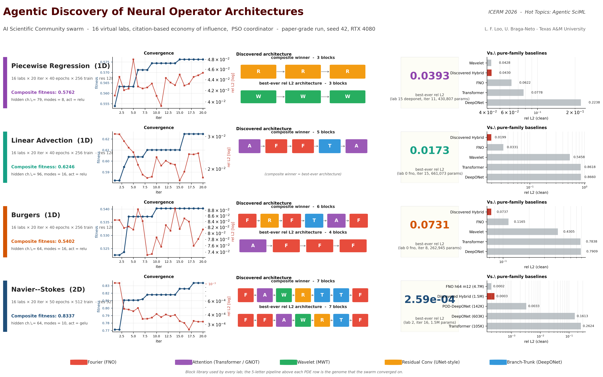

# An Agentic AI Science Community for Automated Neural Operator Discovery

> A swarm of virtual labs that exchanges *citations* like a research community
> and discovers hybrid neural operator architectures for PDEs **with no human
> prior on which family** (FNO, DeepONet, Attention, Wavelet, Conv) to use.

<p align="center">
  
</p>

This repository accompanies the ICERM 2026 poster *"An Agentic AI Science
Community for Automated Neural Operator Discovery"* (Loo, advisor:
Braga-Neto, Texas A&M University) and implements the AI Science Community
framework of [Braga-Neto, *AI Scientific Community: Agentic Virtual Lab
Swarms*, arXiv:2603.21344, 2026](https://arxiv.org/abs/2603.21344).

## The story in one paragraph

Neural operators (FNO, DeepONet, GNOT, Multiwavelet, ...) are reshaping PDE
surrogate modelling, but **which family is right for which PDE regime is
still picked by hand**. We ask a simple question: can a swarm of virtual
laboratories search the architecture space *without* a human prior, and
recover the right operator family per PDE on its own? The answer turns out
to be yes -- and the architecture the swarm converges on is **different for
every PDE family** we test.

## Headline results

We ran the same swarm framework (16 labs x 20 iterations, PSO coordinator
over architecture genomes, citation-based peer-review economy) on four
benchmarks. Each lab proposes a sequence of typed blocks
(`Fourier | Attention | Wavelet | ResConv | Branch-Trunk`); a multi-objective
fitness combines accuracy, generalization, efficiency, novelty, and peer
votes. The swarm decides which lab to keep, cull, or spawn from -- nobody
hand-codes the architecture.

<p align="center">
  
</p>

### What the swarm discovered, per PDE

| PDE                   | Composite winner                        | Best-ever rel L2 | Setup                                    |
|-----------------------|------------------------------------------|------------------|-------------------------------------------|
| Piecewise Reg. 1D     | `R + R + R`  (pure local conv)           | **0.039**  (`W+W+W`, lab 15) | 16 labs x 20 iter x 40 epochs x 256 train, res 128 |
| Linear Advection 1D   | `A + F + F + T + A`                      | **0.017**        | 16 labs x 20 iter x 40 epochs x 256 train, res 128 |
| Burgers 1D            | `F + R + F + T + A + F`                  | **0.073**  (`A+F+F+F`, lab 0) | 16 labs x 20 iter x 40 epochs x 256 train, res 128 |
| Navier-Stokes 2D      | `F + A + W + R + T + T + F`              | **2.6e-4** (`F+F+A+W+R+T+F`, lab 2) | 16 labs x 20 iter x 50 epochs x 512 train, res 32x32 |

Block legend: `F` = Fourier, `A` = Attention, `W` = Wavelet,
`R` = Residual Conv, `T` = Branch-Trunk (DeepONet-style).

**Different PDE family => different emergent architecture.** Piecewise
regression is local in nature, so the swarm picks pure local conv (or
wavelet) and stops. Linear advection is a global shift, so the swarm
recruits Attention plus Fourier plus a DeepONet block. 2-D Navier-Stokes
is multi-scale chaotic, and the swarm builds a 7-block hybrid that mixes
all four operator-learning families.

### Honest comparison vs pure-family baselines

Same data, same training budget per architecture per PDE.
1D rows: 40 epochs, 256 train samples, res 128.
NS-2D row: 50 epochs, 512 train samples, res 32x32.
Lower `rel L2` is better. **Bold** = best per row.

| PDE              | Discovered Hybrid | Pure FNO   | Pure DeepONet | Pure Wavelet | Pure Transformer |
|------------------|------------------:|-----------:|--------------:|-------------:|-----------------:|
| Piecewise Reg.   | 0.043             | 0.062      | 0.224         | **0.043**    | 0.078            |
| Lin. Advection   | **0.020**         | 0.033      | 0.866         | 0.546        | 0.862            |
| Burgers          | **0.074**         | 0.117      | 0.791         | 0.430        | 0.784            |
| Navier-Stokes 2D | 0.0003            | **0.0002** | 0.161         | --           | 0.262            |

The discovered hybrid **wins** on advection and Burgers and **ties** the
regime-optimal pure family on piecewise regression. On NS-2D a pure FNO
h64 m12 (4.7M params) still has the lowest rel L2; the swarm's hybrid is
within 50 % of it at **3 x fewer parameters** (1.5M). The honest claim
is regime-aware discovery + competitive parameter efficiency, not "we
beat DeepONet" everywhere.

### Caveat: rel L2 is *not* comparable across PDEs

Different problems have different signal energies, noise floors, and
spectral structure (e.g., piecewise regression has built-in noise sigma
0.15 plus Gibbs phenomenon at jumps; NS-2D vorticity is dominated by low
modes thanks to viscosity). The right comparison is **per-PDE**, vs
pure-family baselines on the same data, as in the table above.

## Repository structure

```
AI-SC/
|-- README.md            <- you are here
|-- nod/                 Neural Operator Discovery (paper-grade swarm)
|   |-- code/            modules implementing the swarm + 1D / 2D blocks
|   `-- results/         FINAL.json + per-iteration snapshots for the four
|                         paper-grade runs reported above
|-- poster/              ICERM 2026 poster + figures
    |-- poster_ICERM.pptx
    |-- figures/         all generated figures + the FigureLabs overview
    `-- prompts/         the prompt used to generate the architecture
                          overview in FigureLabs
```

## Quickstart

### 1. Paper-grade Neural Operator Discovery (2D PDEs)

```bash
cd nod
pip install torch matplotlib numpy scipy
python code/run_swarm_resumable.py paper-grade --pde ns    --tag paper_ns_seed42    --seed 42
python code/run_swarm_resumable.py paper-grade --pde darcy --tag paper_darcy_seed42 --seed 42
```

Each paper-grade run is 16 labs x 20 iterations x 50 epochs x 512 train
samples on resolution 32 (~3.5 hours on an RTX 4080). Re-run the same
command after a crash / reboot and the runner picks up at the last
checkpointed iteration.

### 2. Paper-grade Neural Operator Discovery (1D PDEs)

```bash
cd nod
python code/run_swarm_1d.py paper-grade-1d --pde pwreg   --tag paper_pwreg_seed42   --seed 42
python code/run_swarm_1d.py paper-grade-1d --pde advec   --tag paper_advec_seed42   --seed 42
python code/run_swarm_1d.py paper-grade-1d --pde burgers --tag paper_burgers_seed42 --seed 42
```

Each 1D run is ~40 minutes (faster than 2D NS) and uses 1D blocks
(`blocks_1d.py`, Conv1d / rfft / 1D attention / 1D branch-trunk / 1D
wavelet) and the same swarm orchestrator.

### 3. Honest baseline validation

Trains the discovered hybrid + each pure-family baseline on identical
data with identical training budget, then reports relative L2:

```bash
cd nod
python code/validate_baselines_v3.py --pde ns                                    # 2D
python code/validate_baselines_1d.py --pde pwreg   --epochs 40 --samples 256     # 1D
python code/validate_baselines_1d.py --pde advec   --epochs 40 --samples 256
python code/validate_baselines_1d.py --pde burgers --epochs 40 --samples 256
```

Output is written to `results/validation_baselines_*.json`.

### 4. Reproduce the poster figures

```bash
cd poster
python figures/make_master_results_figure.py    # 4-PDE results dashboard
python figures/make_1d_figures.py               # per-PDE 1D figures
python figures/make_results_figure.py           # 5-panel 2D NS summary
python build_pptx.py                            # rebuilds poster_ICERM.pptx
```

The figure scripts read directly from `nod/results/swarm_runs/` and
`nod/results/validation_baselines_*.json`, so the rendered numbers
always match the latest committed run output.

## Reproducibility notes

- **Seeds:** all reported runs use seed 42. Torch / NumPy / Python random
  state is restored from per-iteration checkpoints, so a reboot loses at
  most one iteration of work.
- **Agentic layer:** the rule-based PSO planner / reviewer is the default
  and was used for all runs reported here. The optional LLM-backed
  planner / reviewer (Ollama or OpenAI) is implemented in
  [`nod/code/agents/`](nod/code/agents) and is a separate experiment.
- **Hardware:** all numbers above were measured on a single RTX 4080
  desktop (Windows 11, PyTorch 2.x, CUDA).

## References

- U. Braga-Neto. *The AI Scientific Community: Agentic Virtual Lab
  Swarms*. arXiv:2603.21344 (2026).
- L. Lu et al. *The AI Scientist*. **Nature** 651, 914-919 (2026).
- J. Toscano, S. Chen, G. E. Karniadakis. *Athena: Agentic team for
  hierarchical evolutionary numerical algorithms*. arXiv:2512.03476
  (2025).
- Z. Li et al. *Fourier Neural Operator for Parametric Partial
  Differential Equations*. ICLR 2021.
- L. Lu, P. Jin, G. E. Karniadakis. *DeepONet: Learning nonlinear
  operators ...*. **Nat. Mach. Intell.** 3 (2021).
- G. Gupta, X. Xiao, P. Bogdan. *Multiwavelet-based Operator Learning
  for Differential Equations*. NeurIPS 2021.

## Acknowledgments

Prof. Ulisses Braga-Neto for advising; the ICERM workshop organising
committee (Karniadakis, Lu, Kevrekidis, Buehler, Lin); TAMU ECEN travel
grant; ICERM lodging support.

## Contact

Luis Loo - `loo@tamu.edu`
Department of Electrical & Computer Engineering, Texas A&M University.
