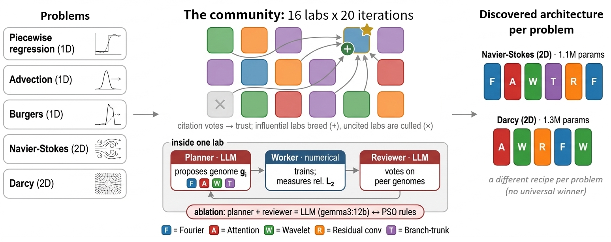

# An Agentic AI Scientific Community for Automated Neural Operator Discovery

**Luis Loo, Ulisses Braga-Neto**, Texas A&M University
*arXiv preprint (link coming soon)*

> Can a community of automated agents discover the right neural operator
> architecture for a given problem, with no human prior on architecture?

A swarm of 16 virtual research labs discovers neural operator architectures the
way science does: each lab **proposes** an architecture (an LLM planner),
**trains and measures** it (a deterministic PyTorch worker), and **peer-reviews**
rival designs (an LLM reviewer). Peer-review votes act as citations: influential
labs breed, uncited labs are culled and replaced. Every LLM decision is ablated
against a rule-based coordinator under an identical training
budget, and every LLM call is logged, so the claim "the agents are LLMs" is
auditable rather than assumed.

<p align="center">
  
</p>

## Key results

- **No universal winner** (matching the operator-learning literature): FNO
  dominates Navier-Stokes, DeepONet-style models dominate Darcy flow, and the
  community rediscovers this problem-dependent structure end to end.
- **The discovered Darcy hybrid** (`attention-wavelet-residual_conv-fourier-wavelet`,
  1.3M params) attains the **best mean converged Darcy error in our baseline
  suite** (0.0631 ± 0.0083), statistically tied with DeepONet (0.0649 ± 0.0037).
- **On Navier-Stokes the canonical answer stands**: the rule-based arm collapses
  to pure-Fourier stacks (the textbook FNO solution). The LLM's hybrid is on par
  with FNO at a matched parameter budget (0.0005 vs. 0.0002 at ~1.1M params, both
  near-perfect) and stays well below every non-FNO baseline.
- **Mechanism, not just outcomes**: across 4,817 logged planner decisions the
  LLM chose *hybridize* 99.8% of the time, which is why it produces multi-family
  hybrids where the rule-based swarm produces canonical single-family designs.
  The LLM reviewer's votes rank-correlate with measured accuracy
  (mean Spearman ρ = 0.64 over 4,804 scoreable calls): fitness-anchored review
  with a diversity tilt.
- **Auditability**: 9,623 LLM calls across the campaign, logged with prompts,
  raw responses, and parse status, with **zero silent rule-based fallbacks**.
- **Cost of agency**: LLM coordination costs 2-4x the wall-clock of rule-based
  coordination at identical training budget (quantified per problem in the paper).

## What is in this repository

```
nod/
  code/                    # framework + experiment pipeline
    agents/                #   LLM planner / reviewer backends (Ollama)
    genome.py              #   architecture genome -> ConfigurableNeuralOperator
    fitness.py             #   screening training + composite fitness
    run_campaign.py        #   resume-safe 30-run campaign driver
    run_swarm_1d.py        #   1D swarm runner (pwreg / advec / burgers)
    run_swarm_resumable.py #   2D swarm runner (Navier-Stokes / Darcy)
    validate_baselines_v3.py # converged cross-method baselines (+ discovered winners)
    aggregate_v2.py        #   tables + evidence audit + behavior mining
    make_v2_figures.py     #   publication figures
    build_paper.py         #   end-to-end paper build
  results/
    swarm_runs/            # all 30 campaign runs: config, per-iteration
                           #   checkpoints, FINAL.json, run logs, and the FULL
                           #   llm_transcript.jsonl of every LLM call
    archive_v2_buggy_e4b/  # earlier campaign whose small LLM silently failed
                           #   JSON output, kept as evidence for the audit
                           #   methodology described in the paper
    exp4v3/                # converged baseline runs (per-model, per-seed JSON)
  paper/                   # LaTeX source, figures, generated tables (compiles
                           #   from a clean clone: pdflatex + bibtex)
poster/                    # ICERM 2026 Hot Topics workshop poster (precursor)
```

## Reproducing

Requirements: Python 3.11, PyTorch (CUDA), matplotlib, and a local
[Ollama](https://ollama.com) server for the LLM condition.

```bash
ollama pull gemma3:12b

# full campaign: 5 problems x {LLM, rule-based} x 3 seeds = 30 runs
# (resume-safe; ~2 days on a single RTX 4080; rule-based runs need no LLM)
OLLAMA_MODEL=gemma3:12b OLLAMA_NUM_CTX=8192 python nod/code/run_campaign.py

# converged cross-method baselines (FNO / DeepONet / POD-DeepONet /
# transformer / discovered winners, 3 seeds each)
python nod/code/validate_baselines_v3.py

# aggregate results -> paper tables + evidence audit + behavior mining
python nod/code/aggregate_v2.py
python nod/code/make_v2_figures.py

# compile the paper
cd nod/paper && pdflatex main.tex && bibtex main && pdflatex main.tex && pdflatex main.tex
```

### Verifying the "agents are LLMs" claim yourself

Each LLM run ships its complete `llm_transcript.jsonl` (system prompt, user
prompt, raw model response, role, parse status, one JSON object per call).
`aggregate_v2.py` recomputes per-run call counts, parse-success and fallback
counts (Table 3 of the paper), the planner action distribution, and the
reviewer score-vs-accuracy correlation directly from these files; nothing about
agent behavior is taken from memory or asserted without a log.

## Framework

This project instantiates the **AI Scientific Community** model of agentic
virtual-lab swarms:

> U. Braga-Neto, *The AI Scientific Community: Agentic Virtual Lab Swarms*,
> arXiv:2603.21344, 2026.

## Citation

```bibtex
@article{loo2026agentic,
  title  = {An Agentic AI Scientific Community for Automated Neural Operator Discovery},
  author = {Loo, Luis and Braga-Neto, Ulisses},
  journal= {arXiv preprint},
  year   = {2026},
  note   = {arXiv identifier to appear}
}
```

## License

MIT, see [LICENSE](LICENSE).

## Contact

Luis Loo, `loo@tamu.edu`
